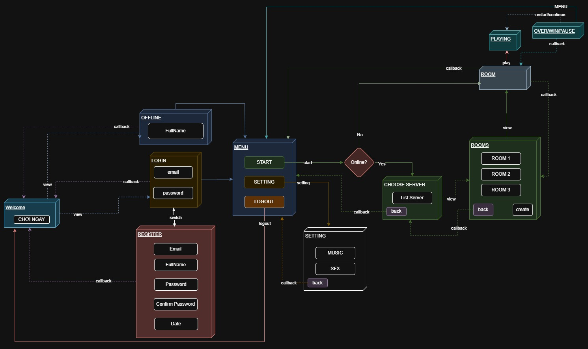
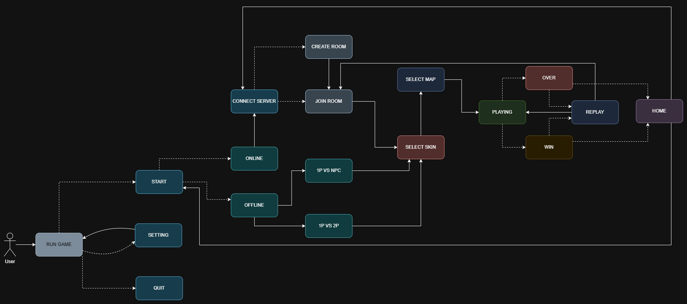

= High Level Design
Long Nguyen Hoang <nghlong3004@gmail.com>
v2.0, 2025-12
:sectnums:
:toc:
:toclevels: 4
:source-highlighter: highlight.js

'''

[small]
====
Author: {author} +
Email: {email} +

Version: {revnumber} ({revdate})
====

== System Overview

* ** Java Swing (Java 21+) **
* ** WebSocket (Java WebSocket) **

== Requirements
.Functional Requirements
[cols="1, 3"]
|===
|Function | Short Description

|Connection
|Kết nối người chơi với server qua WebSocket.

|Disconnection
|Người chơi ngắt kết nối với Server.

|Create Room
|Người chơi tạo phòng mới.

|Rooms
|Lấy danh sách các phòng hiện có.

|Join Room
|Người chơi tham gia vào phòng.

|Leave Room
|Người chơi rời khỏi phòng.

|Chat Message
|Người chơi gửi tin nhắn trong phòng chờ.

|Update Map, Skin, Ready
|Người chơi thay đổi skin, map và trạng thái sẵn sàng.

|Start Game
|Chủ phòng bắt đầu ván đấu.

|Bomber Action
|Xử lý hành động di chuyển, đặt bom của người chơi.
|===

.Non-Functional Requirements
[cols="1,3"]
|===
|Category | Requirement

|Frames Per Second
|FPS > 60.

|Updates Per Second
|UPS > 200.
|===

== Client FLow

== User Flow

== Architectural Style

* ** Client ** :
** network
** game
** ui
** service

== Package Structure

----
com.vn.nghlong3004.client
 ├─ config
 │   ├─ ClientConfig.java
 │   └─ KeyBindingConfig.java
 │
 ├─ network
 │   ├─ websocket
 │   │   ├─ WebSocketClient.java
 │   │   └─ WebSocketListenerImpl.java
 │   ├─ message
 │   │   ├─ MessageType.java
 │   │   ├─ OutgoingMessage.java
 │   │   ├─ IncomingMessage.java
 │   │   └─ serializer
 │   │       ├─ MessageEncoder.java
 │   │       └─ MessageDecoder.java
 │   │─ service
 │   │   ├─ AuthNetworkService.java
 │   │   ├─ LobbyNetworkService.java
 │   │   └─ GameNetworkService.java
 │   ├─ request
 │   │   ├─ LoginRequest.java
 │   │   ├─ MoveCommandRequest.java
 │   │   ├─ PlaceBombRequest.java
 │   │   └─ ChatMessageRequest.java
 │   └─ response
 │       ├─ AuthSuccessResponse.java
 │       ├─ RoomInfoResponse.java
 │       ├─ GameStateSnapshotResponse.java
 │       └─ ErrorResponse.java
 │
 │
 ├─ game
 │   ├─ model
 │   │   ├─ PlayerModel.java
 │   │   ├─ BombModel.java
 │   │   ├─ ExplosionModel.java
 │   │   ├─ MapModel.java
 │   │   └─ ItemModel.java
 │   │
 │   ├─ state
 │   │   ├─ GameState.java
 │   │   ├─ LobbyState.java
 │   │   ├─ RoomState.java
 │   │   └─ InGameState.java
 │   │
 │   ├─ controller
 │   │   ├─ GameLoop.java
 │   │   ├─ PlayerController.java
 │   │   ├─ CameraController.java
 │   │   └─ InputController.java
 │   │
 │   └─ mapper
 │       └─ GameStateMapper.java
 │
 ├─ ui
 │   ├─ screen
 │   │   ├─ LoginScreen.java
 │   │   ├─ RegisterScreen.java
 │   │   ├─ LobbyScreen.java
 │   │   ├─ RoomScreen.java
 │   │   └─ InGameScreen.java
 │   │
 │   ├─ component
 │   │   ├─ GameCanvas.java
 │   │   ├─ PlayerStatusPanel.java
 │   │   ├─ RoomListPanel.java
 │   │   └─ ChatPanel.java
 │   │
 │   ├─ layout
 │   │   └─ UILayoutConstants.java
 │   │
 │   └─ assets
 │       ├─ sprite/
 │       ├─ sound/
 │       └─ font/
 │
 ├─ service
 │
 ├─ exception
 └─ util
----
